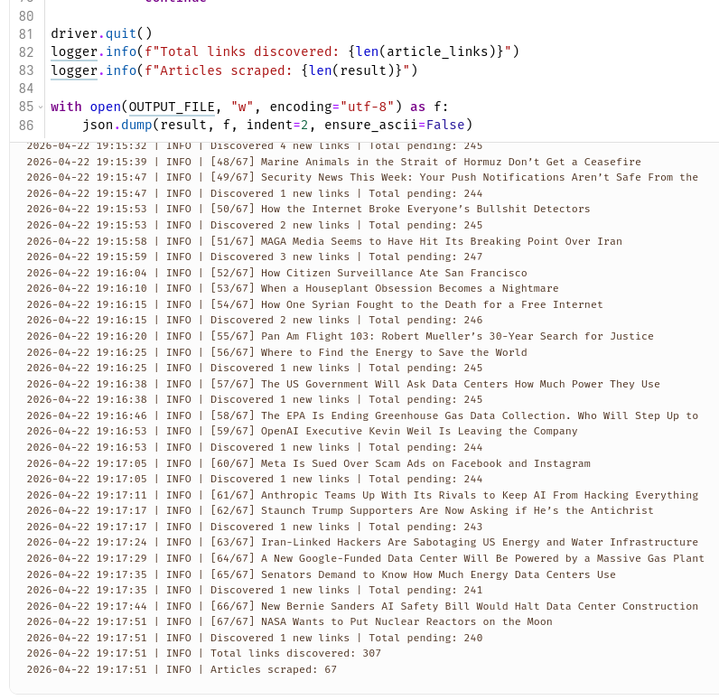
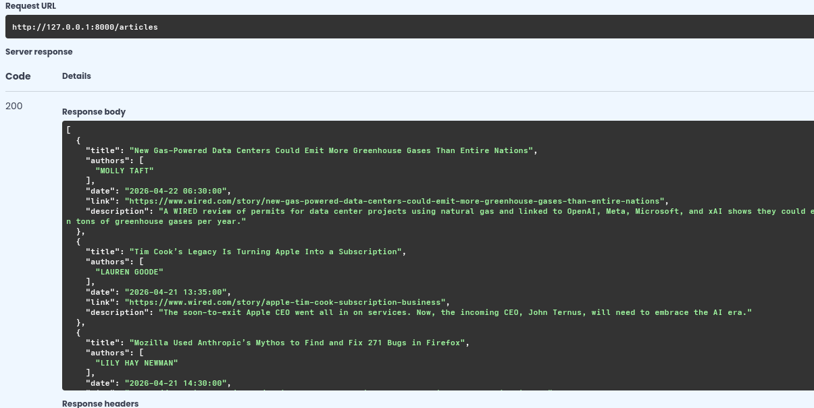
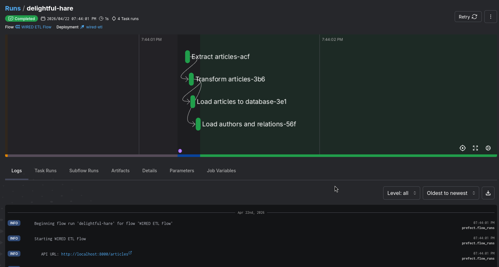
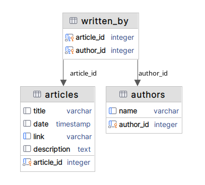
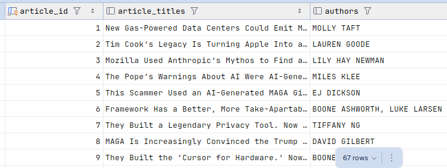

# Praktikum IPBD Responsi UTS
<p align="center">
  Prayuda Afifan Handoyo<br>
  L0224008 | Kelas A<br>
  Infrastruktur dan Platform Big Data
</p>

---

Proyek ini adalah pipeline ETL untuk mengambil artikel dari WIRED.com, menyediakan hasil scraping melalui API REST, lalu menyimpan ke database.

## Arsitektur Sistem

```
scrape wired.com dengan Selenium   -->   API dengan FastAPI   -->   ETL dengan prefect   -->   Database PostgreSQL
```

## Langkah Penggunaan

### 1. Scrape Artikel dari WIRED

Jalankan scraper menggunakan Marimo di folder `scraping-wired/`:

```bash
cd scraping-wired/
uv run marimo edit scrape.py
```

Ini akan membuka interface Marimo untuk menjalankan script scraping. tinggal run noteboook untuk memulai proses scraping artikel dari WIRED.

> note: mungkin anda perlu mengubah path ke driver chromium



Hasil scraping akan disimpan di `scraping-wired/wired_articles.json`.

### 2. Pindahkan Hasil Scraping

Pindahkan file hasil scraping ke folder `api-wired/`:

```bash
mv scraping-wired/wired_articles.json api-wired/wired_articles_final.json
```

File ini akan digunakan sebagai data sumber untuk API.

### 3. Jalankan API Server

Jalankan FastAPI server di folder `api-wired/`:

```bash
cd api-wired/
uv run fastapi dev
```

Atau menggunakan uvicorn:

```bash
uv run uvicorn main:app --reload --port 8000
```

API akan tersedia di `http://localhost:8000`. Untuk melihat dokumentasi API:

- Swagger UI: `http://localhost:8000/docs`



### 4. Jalankan ETL Pipeline dengan Prefect

Mulai layanan PostgreSQL dan Prefect menggunakan Docker Compose:

```bash
cd prefect-dag/
docker compose up -d
```

Setelah semua layanan berjalan, jalankan pipeline ETL:

```bash
cd prefect-dag/
uv run flows/etl.py
```

Pipeline ini akan:
- Membaca data dari `wired_articles_final.json` lewat API
- Melakukan transformasi data
    1. **Validasi data** - Memeriksa kelengkapan field wajib (title, link)
    2. **Normalisasi author** - Mengubah array `authors` menjadi relasi tersendiri dengan junction table `written_by` (many-to-many relationship)
    3. **Hapus duplicate** - Menghapus artikel dengan link yang sama
- Menyimpan data ke database PostgreSQL



### 5. Periksa Database

Setelah ETL berhasil dijalankan, artikel akan tersimpan di database `wired_articles` di PostgreSQL.

Schema database `wired_articles`:



Untuk memeriksa data di database, bisa menggunakan database manager (dbeaver, datagrip, dll). Contoh rows hasil:




## Teknologi yang Digunakan

- **Scraping**: Marimo, Selenium
- **API**: FastAPI, Uvicorn
- **ETL**: Prefect
- **Database**: PostgreSQL
- **Container**: Docker Compose
